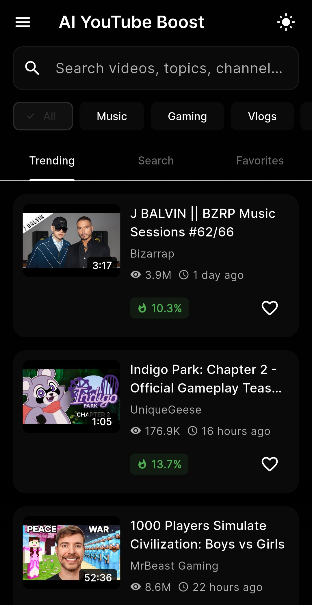
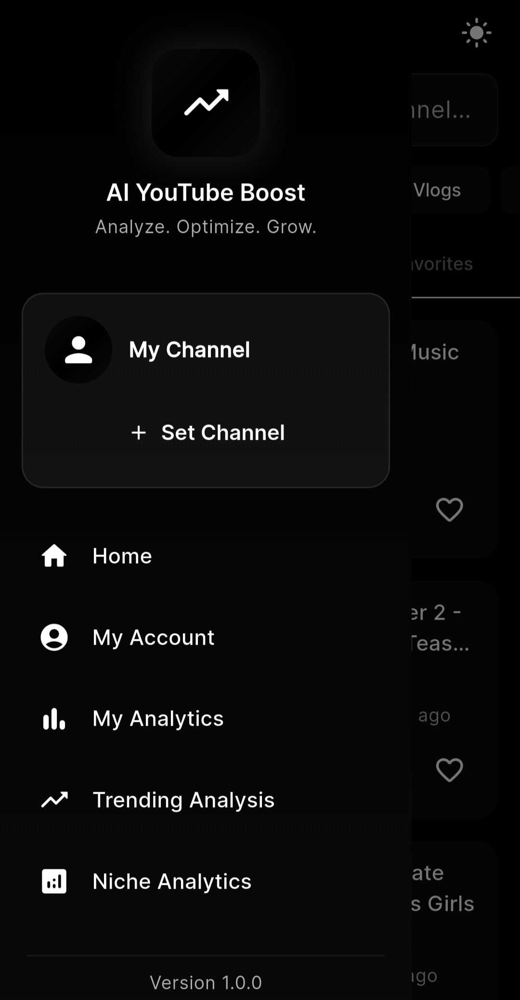

# AI YouTube Boost

A powerful Flutter application designed to help content creators and marketers analyze YouTube trends, discover niches, and optimize their content strategy using advanced analytics and AI-powered insights.

## Features

### 🔥 Trending Analysis
- Real-time trending video discovery
- Category-based filtering
- Trending topics identification
- Growth rate analysis
- Competition level assessment

### 📊 Niche Analytics
- Deep dive into any niche or topic
- View distribution analysis
- Keyword extraction and trends
- Growth indicators
- Competition metrics

### 📈 Channel Analytics
- Connect your YouTube channel
- Performance tracking
- Video statistics
- Engagement rate analysis
- Publishing pattern insights

### 🤖 AI-Powered Features
- Multiple AI model support
- Viral potential prediction
- Content insights generation
- Keyword suggestions
- Trending score calculation

### ⚙️ Customization
- Dual theme support (Liquid Blue & Liquid Dark)
- Multi-language support (English, Serbian)
- Region-specific content
- Personalized user preferences

## Screenshots



###



## Getting Started

### Prerequisites

- Flutter SDK (3.0.0 or higher)
- Dart SDK (3.0.0 or higher)
- YouTube Data API v3 key

### Installation

1. Clone the repository:
```bash
git clone https://github.com/Luka12-dev/AI-Youtube-Boost.git
cd AI-Youtube-Boost
```

2. Install dependencies:
```bash
flutter pub get
```

3. Run the app:
```bash
flutter run
```

## Configuration

### YouTube API Key

1. Go to [Google Cloud Console](https://console.cloud.google.com/)
2. Create a new project or select an existing one
3. Enable YouTube Data API v3
4. Go to Credentials section
5. Create API Key
6. Enter the key in the app's API setup screen

**Note:** The API key is stored locally on your device and is never shared.

## Architecture

The app follows a clean architecture pattern with clear separation of concerns:

```
lib/
├── models/          # Data models
├── providers/       # State management (Provider pattern)
├── screens/         # UI screens
├── widgets/         # Reusable UI components
├── services/        # Business logic and API services
├── theme/           # Theme configuration
└── l10n/            # Localization files
```

For detailed architecture documentation, see [ARCHITECTURE.md](ARCHITECTURE.md).

## Key Technologies

- **Framework:** Flutter
- **State Management:** Provider
- **Local Storage:** SharedPreferences
- **HTTP Client:** http package
- **Image Caching:** cached_network_image
- **Animations:** flutter_animate
- **Charts:** fl_chart
- **Fonts:** google_fonts

## Features in Detail

### Video Search & Discovery
- Search videos by keywords
- Filter by categories
- View trending videos by region
- Save favorite videos
- Track search history

### Analytics Dashboard
- Video performance metrics
- Engagement rate calculation
- View distribution analysis
- Publishing pattern insights
- Top performer identification

### Niche Analysis
- Search volume estimation
- Competition level assessment
- Growth rate calculation
- Related keyword discovery
- Opportunity identification

### AI Model Management
- Download and manage AI models
- Model version tracking
- Progress monitoring
- Local model storage

## Localization

The app supports multiple languages:
- English (en)
- Serbian (sr)

To add a new language:
1. Create a new file in `lib/l10n/`
2. Extend `AppLocalizations` class
3. Implement all required translations
4. Add to supported locales in main app

## Theme System

Two custom themes available:
- **Liquid Blue:** Light theme with blue gradients
- **Liquid Dark:** Dark theme with minimal aesthetic

Themes feature:
- Custom color schemes
- Gradient backgrounds
- Consistent typography
- Smooth transitions

## Contributing

Contributions are welcome! Please feel free to submit a Pull Request.

1. Fork the project
2. Create your feature branch (`git checkout -b feature/AmazingFeature`)
3. Commit your changes (`git commit -m 'Add some AmazingFeature'`)
4. Push to the branch (`git push origin feature/AmazingFeature`)
5. Open a Pull Request

## License

This project is licensed under the MIT License - see the LICENSE file for details.

## Acknowledgments

- YouTube Data API v3 for video data
- Flutter community for excellent packages
- Google Fonts for typography
- All contributors and testers

## Contact

**Developer:** Luka12-dev

- GitHub: [@Luka12-dev](https://github.com/Luka12-dev/)
- YouTube: [@LukaCyber-s4b7o](https://www.youtube.com/@LukaCyber-s4b7o)

## Support

If you find this project helpful, please consider giving it a ⭐️!

For bug reports and feature requests, please open an issue on GitHub.

---

**Made with dedication for content creators** • © 2025 Luka